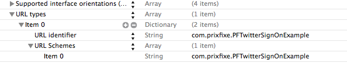

PFTwitterSignOn
----


**Motivation**

I have implemented Twitter SSO on a few iOS apps, and the process is relatively easy until you need an access token or secret for the authenticating user.

I looked around, and couldn't find a library to obfuscate the super annoying reverse auth process you have to use to get a users' info from twitter, so I wrote this wrapper to allow block-based, dead simple twitter authentication with support for new-style native auth and old-style redirect auth.

This library builds on the work of [LVTwitterOAuthClient](https://github.com/loovin/LVTwitterOAuthClient) (which in turn appears to be built from [Sean Cook](https://twitter.com/theSeanCook)'s [TWReverseAuthExample](https://github.com/seancook/TWReverseAuthExample)), and [AFOAuth1Client](https://github.com/AFNetworking/AFOAuth1Client) for the oAuth 1.0 redirect flow.

**Usage**

See the example project for a full implementation. Here's the basics:

- add a `PFTwitterSignOn` to your `Podfile`.

- add a custom url scheme to handle callbacks from safari. This will just be your bundle identifier:



- import `<AFOAuth1Client/AFOAuth1Client.h>` to your app delegate header, and the following method (or add the notification to the existing method)
```
    - (BOOL)application:(UIApplication *)application openURL:(NSURL *)url sourceApplication:(NSString *)sourceApplication annotation:(id)annotation
    {
        [[NSNotificationCenter defaultCenter] postNotification:[NSNotification notificationWithName:kAFApplicationLaunchedWithURLNotification object:nil userInfo:@{kAFApplicationLaunchOptionsURLKey: url}]];
    
        return YES;
    }
```
- before requesting access with this library, set your consumer key and secret using the following method:
```
    [PFTwitterSignOn setCredentialsWithConsumerKey:@"<your_consumer_key>" andSecret:@"<your_consumer_secret>"];
```
- PFTwitterSignOn dispatches notifications to let you know when you should display a loading dialog. You can listen to the 2 notifications on whatever controller will be doing the authentication:

```
    [[NSNotificationCenter defaultCenter] addObserver:self selector:@selector(showLoadingWithNotification:) name:PF_TWITTER_SIGN_ON_LOADING_STARTED_NOTIFICATION object:nil];
    
    [[NSNotificationCenter defaultCenter] addObserver:self selector:@selector(showLoadingWithNotification:) name:PF_TWITTER_SIGN_ON_LOADING_ENDED_NOTIFICATION object:nil];
```

**Requesting Access**

PFTwitterSignOn has 2 methos for requesting a user's twitter account. The first allows you to pass a view, and shows a standard action sheet to ask the user to select an account. If the user only has one account, both methods are identical in user experience.

The first is:

    + (void)requestAuthenticationInView:(UIView *)view andCompletion:(twitterAuthenticationCallback)callback;

The view is the view you would like to present the action sheet in if the user has multiple accounts.

The other allows you to create a custom select view, and just passes an array of `ACAccount`s and a callback to a block:

    + (void)requestAuthenticationWithSelectCallback:(twitterSelectAccountCallback)selectCallback andCompletion:(twitterAuthenticationCallback)callback;

`twitterSelectCallback` is a block with the definition : `void (^twitterSelectAccountCallback)(NSArray *accounts, twitterAccountCallback callback);`.

`twitterAccountCallback` is also a block, with the definition : `void (^twitterAccountCallback)(ACAccount *account);`.

PFTwitterSignOn will automatically detect if the user has twitter accounts stored, and if not it will use an oAuth flow via the browser, so you can always it expect to be able to get the users' information. Both authentication methods call back to a completion callback, which has the definition:

    void (^twitterAuthenticationCallback)(NSDictionary *accountInfo, NSError *error);

The dicttionary is all the users' account information sent back from the api, as well as 2 additional keys, `accessToken` and `tokenSecret`. These are the credentials you'll need to make calls on behalf of the user.
